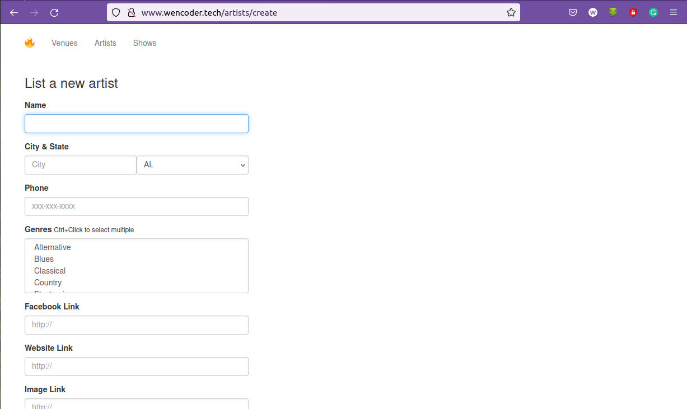
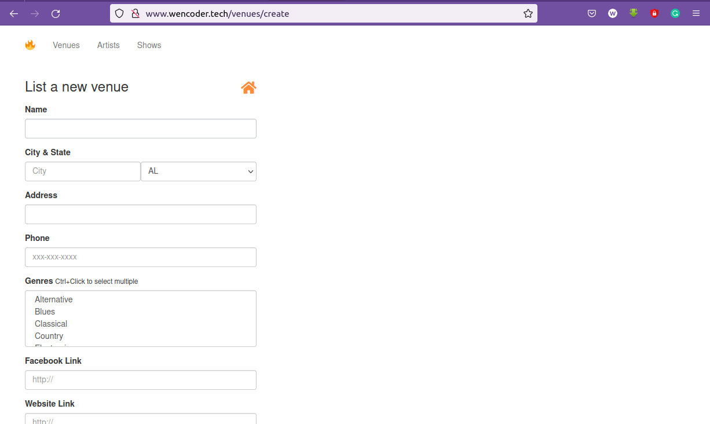
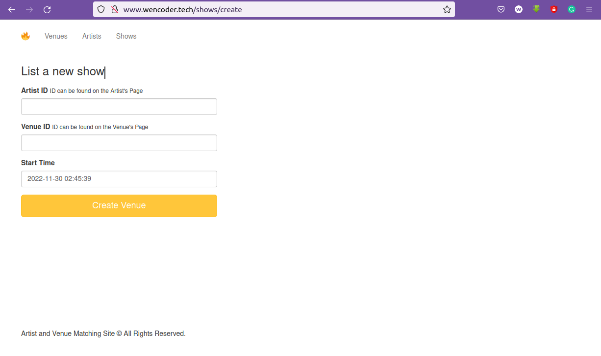

[Post venue](http://www.wencoder.tech/venues/create)               [Post artist](http://www.wencoder.tech/artists/create)                [Create show](http://www.wencoder.tech/shows/create)

# Artist and Venue Matching Site
## Where musical artists meet musical venues.

To discover more functionality press on the link below

[Click me](http://www.wencoder.tech/)

# *Features*

# List a new artist
In this page, any interested artist can post himself/herself to be ready for a show

# List a new venue
In this page, any available venue can be posted to be ready for a show

# List a new show
In this page, shows can be created by matching interested artists and venue to each other

# *About*
Initiation for this project come to me, as the music industry is keep growing and also more concert are being held in different places, for simplifying the creation of shows and easly connecting artists and venues. It is done as a portfolio project for [holberton school](https://www.holbertonschool.com/)

[My linkedin profile](https://www.linkedin.com/in/wendwossen-dufera/)
[My twitter profile](https://t.co/Co66LTHCnK)
[My github profile](https://github.com/wendecoder)

[Link to the project](https://github.com/wendecoder/Portfolio_project.git)

